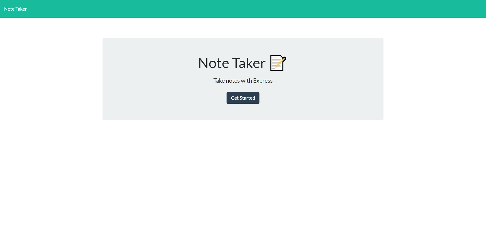
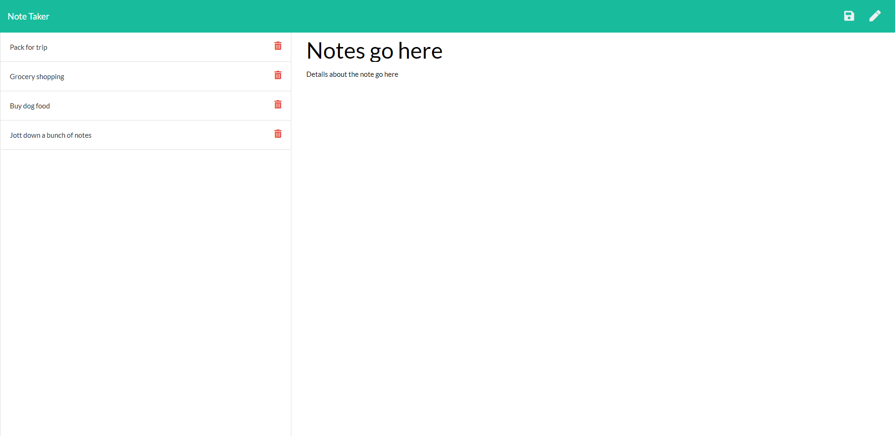
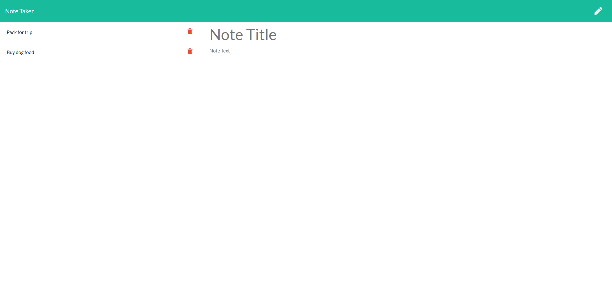

# Note Jotter

## Contributers
* Chris Whalen, Github: **[CobaltFrostfish](https://github.com/CobaltFrostfish)**

## Links
* **[Repository](https://github.com/CobaltFrostfish/note-jotter)**
* **[Live app](https://fierce-ocean-49311.herokuapp.com/)**
# 

## The project
Do you need a simple app to jott down notes? Well This app does just that. The app is made to be simple and easy to use. Click into the app, add your notes, click the save button and viola, notes! Accidentally closed or refreshed the window? No need to fear, your notes have been safely saved with the help of an express server. Along with your notes being saved you also have the option to delete any notes as needed. So go ahead and note fearlessly!

## Technologies applied
* JavaScript
* NodeJS
* HTML
* Express
* Heroku

## The final production:

